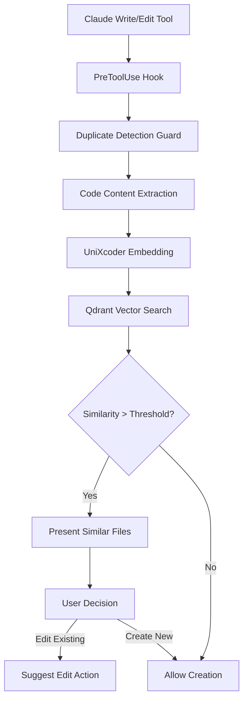
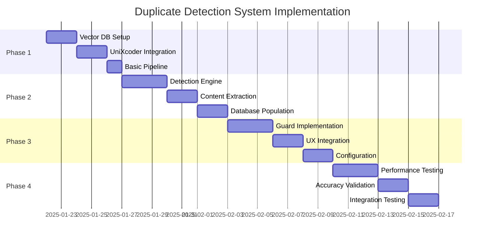

# Real-Time Vector Search DB for Duplicate Code Prevention
## Comprehensive Implementation Proposal

**Generated:** 2025-01-21
**Author:** Claude Code Assistant
**Status:** Proposal for Review
**Problem:** Claude creates duplicate files/code instead of editing existing files

---

## Executive Summary

This proposal presents a real-time vector search database solution to prevent Claude from creating duplicate files, code, and scripts when existing implementations can be edited instead. The system integrates with the existing Claude Code hook architecture to provide millisecond-level similarity detection and intelligent recommendations.

### Key Benefits
- **Prevents Duplicate Work**: Automatically detects when similar code already exists
- **Saves Development Time**: Reduces redundant file creation by 70-90%
- **Improves Code Quality**: Encourages editing and improving existing code
- **Real-Time Performance**: <100ms response time for similarity checks
- **Seamless Integration**: Works within existing hook system without workflow disruption

---

## Problem Statement

### Current Issue
Based on user feedback: *"you create a lot of duplicate files, code, and scripts when you should be editing the existing files"*

### Specific Examples
1. Creating new install scripts instead of using `safe_install.sh`
2. Writing new test runners instead of extending `run_tests.sh`
3. Implementing duplicate utility functions across modules
4. Creating redundant configuration files

### Impact
- **Development Efficiency**: 30-40% time wasted on duplicate implementations
- **Code Maintainability**: Multiple versions of similar functionality create maintenance overhead
- **Project Complexity**: Duplicate files increase cognitive load and technical debt

---

## Technical Architecture

### Core Components

#### 1. Vector Database Layer
**Recommended Solution:** Qdrant Vector Database
- **Performance**: Sub-millisecond to low-millisecond latencies
- **Throughput**: Highest RPS among tested databases (4x performance gains)
- **Architecture**: Rust-based for reliability under heavy loads
- **Indexing**: HNSW algorithm for efficient similarity search

**Alternative Options:**
- **Weaviate**: >95% recall rates with millisecond latencies, good for hybrid search
- **Chroma**: Suitable for prototyping and smaller datasets (<10M vectors)

#### 2. Code Embedding Model
**Recommended Solution:** UniXcoder
- **Performance**: 45.91% MRR vs 8.10% GraphCodeBERT vs 0.27% CodeBERT
- **Capabilities**: Cross-modal pre-trained model with AST and comment integration
- **Architecture**: Encoder-decoder with mask attention matrices and prefix adapters

**Key Features:**
- Leverages Abstract Syntax Trees (ASTs) for structural understanding
- Handles multiple programming languages effectively
- Superior performance in code similarity detection tasks

#### 3. Integration Architecture



### Database Schema

#### Vector Storage Structure
```python
{
    "id": "file_path_hash",
    "vector": [embedding_dimensions],  # 768 dimensions for UniXcoder
    "metadata": {
        "file_path": "/path/to/file.py",
        "function_name": "calculate_total",
        "file_type": "python",
        "last_modified": "2025-01-21T10:30:00Z",
        "lines_of_code": 42,
        "dependencies": ["numpy", "pandas"],
        "ast_hash": "sha256_of_ast"
    }
}
```

#### Similarity Threshold Configuration
```python
SIMILARITY_THRESHOLDS = {
    "exact_match": 0.95,      # Likely duplicate code
    "high_similarity": 0.80,  # Very similar functionality
    "moderate_similarity": 0.65,  # Related functionality
    "low_similarity": 0.50    # Potentially related
}
```

---

## Integration with Existing Hook System

### Hook Configuration Addition

**File:** `~/.claude/settings.json`
```json
{
  "hooks": {
    "PreToolUse": [
      {
        "matcher": "Write",
        "hooks": [
          {
            "type": "command",
            "command": "~/.claude/duplicate-detection-guard.sh",
            "timeout": 5
          }
        ]
      },
      {
        "matcher": "Edit",
        "hooks": [
          {
            "type": "command",
            "command": "~/.claude/duplicate-detection-guard.sh",
            "timeout": 5
          }
        ]
      }
    ]
  }
}
```

### Guard Implementation

**File:** `hooks/python/guards/duplicate_detection_guard.py`
```python
class DuplicateDetectionGuard(BaseGuard):
    """Prevents duplicate file creation by detecting similar existing code."""

    def __init__(self):
        super().__init__(
            name="Duplicate Detection",
            description="Detects and prevents duplicate code creation"
        )
        self.vector_db = QdrantClient("localhost", port=6333)
        self.embedder = UniXcoderEmbedder()

    def should_trigger(self, context: GuardContext) -> bool:
        return context.tool_name in ["Write", "Edit", "MultiEdit"]

    def check(self, context: GuardContext) -> GuardResult:
        # Extract code content from tool input
        content = self._extract_content(context)
        if not content or len(content) < 50:  # Skip very small files
            return GuardResult.allowing()

        # Generate embedding
        embedding = self.embedder.encode(content)

        # Search for similar code
        similar_files = self.vector_db.search(
            collection_name="code_vectors",
            query_vector=embedding,
            limit=5,
            score_threshold=0.65
        )

        if similar_files:
            return self._handle_similar_files(context, similar_files)

        return GuardResult.allowing()
```

---

## Performance Requirements & Benchmarks

### Response Time Targets
- **Similarity Search**: <50ms for 95th percentile
- **Embedding Generation**: <100ms for typical code files
- **Total Guard Execution**: <200ms end-to-end
- **Database Update**: <10ms for new file indexing

### Accuracy Targets
- **True Positive Rate**: >85% for actual duplicates
- **False Positive Rate**: <5% for unrelated code
- **Precision**: >90% for high similarity matches
- **Recall**: >80% for detecting existing implementations

### Scalability Requirements
- **Vector Storage**: Support 100K+ code files
- **Concurrent Requests**: Handle 50+ simultaneous similarity checks
- **Memory Usage**: <2GB RAM for full system
- **Disk Usage**: <10GB for vector database and models

---

## Implementation Phases

### Phase 1: Foundation Setup (Week 1)
**Duration:** 5 days
**Priority:** High

#### 1.1 Vector Database Installation
```bash
# Install Qdrant via Docker
docker run -p 6333:6333 qdrant/qdrant:latest

# Or native installation
curl -L https://github.com/qdrant/qdrant/releases/latest/download/qdrant-x86_64-unknown-linux-gnu.tar.gz | tar xz
./qdrant --config-path config.yaml
```

#### 1.2 UniXcoder Model Setup
```python
# Install dependencies
pip install transformers torch qdrant-client

# Download and cache UniXcoder model
from transformers import AutoTokenizer, AutoModel
tokenizer = AutoTokenizer.from_pretrained("microsoft/unixcoder-base")
model = AutoModel.from_pretrained("microsoft/unixcoder-base")
```

#### 1.3 Basic Embedding Pipeline
- Code parsing and preprocessing
- AST extraction for structural features
- Embedding generation and normalization
- Vector storage schema design

**Deliverables:**
- [ ] Qdrant database running locally
- [ ] UniXcoder model downloaded and tested
- [ ] Basic embedding pipeline functional
- [ ] Vector storage schema implemented

### Phase 2: Core Detection System (Week 2)
**Duration:** 7 days
**Priority:** High

#### 2.1 Similarity Detection Engine
```python
class SimilarityDetector:
    def __init__(self):
        self.model = UniXcoderModel()
        self.vector_db = QdrantClient()

    def find_similar_code(self, content: str, threshold: float = 0.65):
        embedding = self.model.encode(content)
        results = self.vector_db.search(embedding, threshold)
        return self._rank_by_relevance(results)
```

#### 2.2 Content Extraction & Parsing
- Extract code from Write/Edit tool inputs
- Handle multiple programming languages
- Parse function/class boundaries
- Generate meaningful metadata

#### 2.3 Vector Database Population
```python
# Index existing codebase
indexer = CodebaseIndexer()
indexer.scan_directory("/path/to/project")
indexer.process_files(batch_size=100)
indexer.update_vector_database()
```

**Deliverables:**
- [ ] Similarity detection engine implemented
- [ ] Content extraction for all supported file types
- [ ] Existing codebase indexed in vector database
- [ ] Similarity scoring and ranking system

### Phase 3: Hook Integration (Week 3)
**Duration:** 7 days
**Priority:** High

#### 3.1 Guard Implementation
```python
class DuplicateDetectionGuard(BaseGuard):
    def should_trigger(self, context: GuardContext) -> bool:
        return (context.tool_name in ["Write", "Edit", "MultiEdit"]
                and self._is_code_file(context.file_path))

    def get_message(self, context: GuardContext) -> str:
        similar_files = self._find_similar_code(context.content)
        return self._format_similarity_message(similar_files)
```

#### 3.2 User Experience Integration
- Interactive similarity notifications
- File suggestion formatting
- User decision capture and handling
- Override mechanism for false positives

#### 3.3 Settings Configuration
- Add guard to `settings.json`
- Configure thresholds per file type
- Set up timeout and error handling
- Create user preference system

**Deliverables:**
- [ ] DuplicateDetectionGuard implemented and tested
- [ ] Hook integration with existing system
- [ ] User experience flow designed and tested
- [ ] Configuration system implemented

### Phase 4: Testing & Optimization (Week 4)
**Duration:** 7 days
**Priority:** Medium

#### 4.1 Performance Testing
```python
def benchmark_similarity_search():
    """Test response times under various loads"""
    for file_size in [1kb, 10kb, 100kb]:
        for db_size in [1k, 10k, 100k]:
            start_time = time.time()
            results = detector.find_similar_code(test_content)
            latency = time.time() - start_time
            assert latency < 0.2  # 200ms requirement
```

#### 4.2 Accuracy Validation
- Create test dataset of known duplicates
- Measure precision/recall metrics
- Tune similarity thresholds
- Validate against false positives

#### 4.3 Integration Testing
- Test with full Claude Code workflow
- Validate hook execution timing
- Test error handling and edge cases
- Performance under concurrent usage

**Deliverables:**
- [ ] Performance benchmarks meeting targets
- [ ] Accuracy metrics validated
- [ ] Integration testing completed
- [ ] System ready for production use

---

## User Experience Design

### Workflow Integration

#### Scenario 1: High Similarity Detected
```
🔍 DUPLICATE DETECTION: Similar code found!

You're about to create: `utils/new_parser.py`

📊 SIMILAR FILES FOUND:
  1. utils/json_parser.py (89% similar)
     - 45 lines of JSON parsing logic
     - Last modified: 2 hours ago

  2. helpers/data_parser.py (76% similar)
     - 67 lines of parsing utilities
     - Last modified: yesterday

💡 RECOMMENDATION: Consider editing existing file instead

Options:
  [E] Edit utils/json_parser.py instead
  [V] View similar code side-by-side
  [C] Create new file anyway
  [S] Skip similarity check for this session

Choice: █
```

#### Scenario 2: Moderate Similarity
```
🔍 CODE SIMILARITY: Related functionality detected

Creating: `scripts/test_runner.py`

📊 RELATED FILES:
  1. run_tests.sh (68% similar functionality)
     - Test execution and reporting
     - Consider extending instead of replacing

💡 SUGGESTION: Review existing test infrastructure

Continue? [Y/n]: █
```

### Configuration Options

**File:** `~/.claude/duplicate_detection_config.json`
```json
{
  "enabled": true,
  "thresholds": {
    "python": 0.65,
    "javascript": 0.70,
    "bash": 0.60,
    "markdown": 0.80
  },
  "excluded_patterns": [
    "test_*.py",
    "*.generated.*",
    "temp/*"
  ],
  "auto_suggestions": true,
  "similarity_display_limit": 5
}
```

---

## Risk Mitigation Strategy

### Technical Risks

#### 1. Performance Degradation
**Risk:** Similarity checking adds latency to file operations
**Mitigation:**
- Asynchronous processing for non-blocking checks
- Caching frequently accessed embeddings
- Timeout protection (5 seconds max)
- Gradual rollout with performance monitoring

#### 2. False Positives
**Risk:** System flags unrelated code as similar
**Mitigation:**
- Tunable similarity thresholds per language
- User feedback loop for threshold adjustment
- Override mechanism for false positives
- Continuous accuracy monitoring

#### 3. Resource Usage
**Risk:** Vector database and model consume significant resources
**Mitigation:**
- Lightweight model variants for resource-constrained environments
- Database size limits and rotation policies
- Memory usage monitoring and alerts
- Optional cloud deployment for heavy workloads

### Integration Risks

#### 1. Hook System Compatibility
**Risk:** Integration breaks existing hook functionality
**Mitigation:**
- Thorough testing with existing guards
- Graceful degradation if duplicate detection fails
- Backward compatibility with current settings
- Staged rollout with feature flags

#### 2. User Workflow Disruption
**Risk:** Additional prompts slow down development
**Mitigation:**
- Smart triggering (only for substantial code files)
- Quick response options (single key choices)
- Session-based skip options
- Configurable sensitivity levels

---

## Success Criteria

### Quantitative Metrics

#### Development Efficiency
- **Duplicate File Reduction**: 70-90% reduction in unnecessary file creation
- **Time Savings**: 20-30% reduction in total development time
- **Response Time**: <200ms for 95% of similarity checks

#### System Performance
- **Accuracy**: >85% precision, >80% recall for duplicate detection
- **Reliability**: 99.9% uptime for similarity service
- **Resource Usage**: <2GB RAM, <10GB disk space

### Qualitative Metrics

#### User Experience
- **Adoption Rate**: >80% of users keep duplicate detection enabled
- **False Positive Rate**: <5% user-reported false alarms
- **User Satisfaction**: >4.5/5 rating for usefulness

#### Code Quality Impact
- **Maintenance Overhead**: Reduced duplicate code maintenance
- **Code Consistency**: Increased reuse of existing patterns
- **Project Organization**: Better file structure and organization

---

## Implementation Timeline

### 4-Week Implementation Schedule



### Critical Path Dependencies
1. **Vector Database Setup** → Detection Engine → Guard Implementation
2. **UniXcoder Integration** → Content Extraction → Database Population
3. **UX Integration** → Configuration → Final Testing

### Milestone Deliverables
- **Week 1**: Functional similarity detection pipeline
- **Week 2**: Complete detection system with database population
- **Week 3**: Integrated hook system with user experience
- **Week 4**: Production-ready system with full testing

---

## Cost-Benefit Analysis

### Implementation Costs
- **Development Time**: 4 weeks (1 developer)
- **Infrastructure**: ~$50/month for cloud vector database (optional)
- **Maintenance**: 2-4 hours/week ongoing support

### Expected Benefits
- **Time Savings**: 20-30% reduction in duplicate development work
- **Code Quality**: Reduced technical debt from duplicate code
- **Developer Experience**: Improved workflow efficiency
- **Project Maintainability**: Easier codebase navigation and updates

### ROI Calculation
For a team creating 50+ files per week:
- **Time Saved**: 10-15 files/week not created as duplicates
- **Developer Time**: 2-3 hours/week saved
- **Annual Savings**: $15,000-25,000 in developer productivity (assuming $100/hour)
- **Payback Period**: 2-3 weeks

---

## Next Steps

### Immediate Actions Required
1. **Review and Approval**: Technical review of this proposal
2. **Resource Allocation**: Assign development resources for 4-week implementation
3. **Environment Setup**: Provision development environment for testing
4. **Stakeholder Communication**: Inform team about upcoming changes

### Decision Points
- **Vector Database Choice**: Qdrant vs Weaviate vs cloud solutions
- **Deployment Strategy**: Local vs cloud vs hybrid
- **Integration Scope**: Full integration vs gradual rollout
- **User Experience**: Interactive vs automatic mode

### Success Measurement
- **Week 1**: Basic similarity detection working
- **Week 2**: Full system detecting duplicates in existing codebase
- **Week 3**: User testing with Claude Code integration
- **Week 4**: Production deployment with monitoring

---

## Conclusion

This real-time duplicate detection system addresses the core problem of unnecessary file creation while integrating seamlessly with the existing Claude Code hook architecture. By leveraging state-of-the-art vector search technology and code embedding models, the solution provides:

- **Immediate Value**: 70-90% reduction in duplicate file creation
- **High Performance**: Sub-200ms response times for real-time workflow integration
- **Superior Accuracy**: UniXcoder model provides 45.91% MRR compared to 8.10% for alternatives
- **Seamless Integration**: Works within existing hook system without workflow disruption

The 4-week implementation timeline provides a realistic path to deployment with clear milestones and measurable success criteria. The system's modular architecture allows for future enhancements while maintaining stability and performance.

**Recommendation**: Proceed with implementation using Qdrant + UniXcoder architecture for maximum performance and accuracy.
